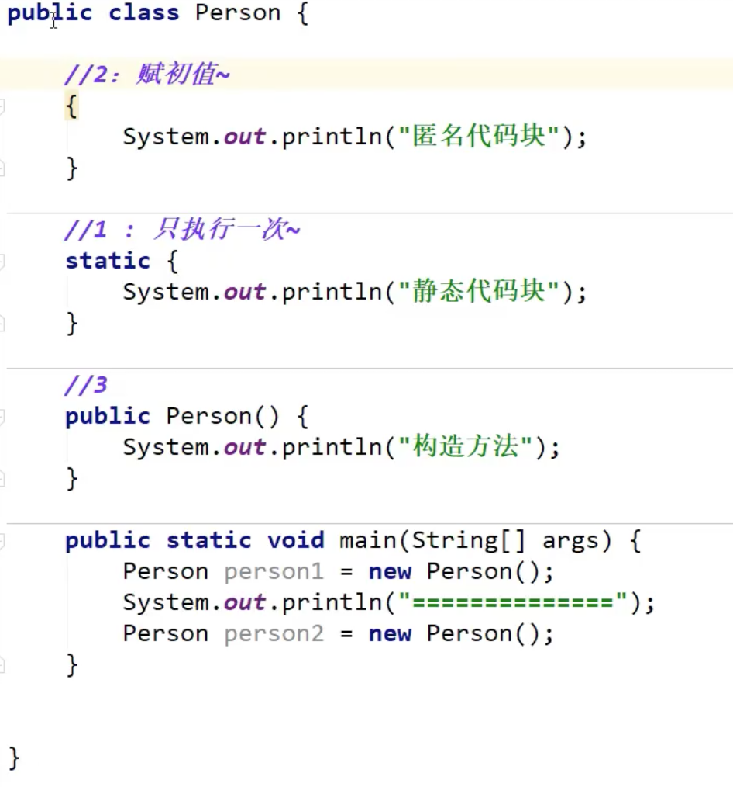

## Java 方法

对于非静态方法（即非 static 关键字修饰的方法），首先要使用 new 关键字实例化类，生成一个对象，再通过对象名.方法名()的方式去调动方法。

```java
class World {

    public void printText() {
        System.out.println("你好");
        System.out.println("Java帝国");
    }

    public static void main(String[] args) {
	    World china = new World();
	    // 调用printText方法
	    china.printText();
	}
}
```

对于静态方法（即 static 关键字修饰的方法），可以直接对象名.方法名()的方式去调动方法，或者直接使用方法。

```java
class World {

    public void printText() {
        System.out.println("你好");
        System.out.println("Java帝国");
    }

    public static void main(String[] args) {
	    
	    // 调用printText方法
	    World.printText();
	    printText();
	}
}
```



### 可变参数

```java
参数类型... 参数名

public void sum(int... n) {
    int sum = 0;
    // 可以对可变参数进行迭代
    for (int i: n) {
        sum = sum + i;
    }
    System.out.println("sum=" + sum);
}
```

### 重载

判断一个方法是否是重载方法的原则：方法名相同，返回值相同，参数类型或参数个数不同

## Java 类和对象

### 对象的实例化

```java
Student student = new Student();
关于对象的实例化过程，可以分为两部分：

声明对象：在内存的栈空间中执行。Student student;
实例化对象：在内存的堆空间执行。new Student();

```

### 构造方法

当类内部我们没有显示定义构造方法时，系统会自动添加无参的构造方法；当在类内部显示定义了构造方法，系统不会自动添加无参构造方法

参数列表中参数变量的命名和实例属性相同,使用 this

```
public Student(String nickname) {
  	this.nickname = nickname;
}
```

## 面向对象的三大特征

### 封装

封装隐藏了对象的信息，并且留出了访问的接口。

1.修改属性的可见性为 private； 2.创建公开的 getter 和 setter 方法，分别用于属性的读写； 3.在 getter 和 setter 方法中，对属性的合法性进行判断。

```java
public class Person {
    // 姓名
    private String name;
    // 年龄
    private int age;

    // 全参构造方法
    public Person(String name, int age) {
        this.setName(name);
        this.setAge(age);
    }

    // 单参构造方法
    public Person(int name) {
        this(name, null);
    }


    public String getName() {
        return name;
    }

    public void setName(String name) {
        this.name = name;
    }

    public int getAge() {
        return age;
    }

    public void setAge(int age) {
        // 判断参数age的合法性
        if(age < 0) {
            this.age = 0;
        }
        this.age = age;
    }

    public static void main(String[] args) {
       Person ming = new Person();

        ming.setName("Ming");
        ming.setAge(15);

        System.out.println("姓名：" + ming.getName());
        System.out.println("年龄：" + ming.getAge());
        System.out.println("-------------");

        Person fang = new Person("fang", 6);

        System.out.println("姓名：" + fang.getName());
        System.out.println("年龄：" + fang.getAge());
    }
}

```

### 继承


#### 方法重写（覆写）


Java 中的方法重写（Overriding）是说子类重新定义了父类的方法。方法重写必须有相同的方法名，参数列表和返回类型。覆盖者访问修饰符的限定大于等于父类方法。

在要重写的方法上面，`可以选择使用 @Override 注解`，让编译器帮助检查是否进行了正确的重写。如果重写有误，编译器会提示错误。


#### 访问修饰符


| 访问控制修饰符         | 同一个类 | 同一个包 | 不同包的子类 | 不同包的非子类 |
| :--------------------- | :------: | -------: | -----------: | -------------: |
| private（私有的）      |    ✓     |        ✕ |            ✕ |              ✕ |
| default （默认的）     |    ✓     |        ✓ |            ✕ |              ✕ |
| protected （受保护的） |    ✓     |        ✓ |            ✓ |              ✕ |
| public （公共的）      |    ✓     |        ✓ |            ✓ |              ✓ |


#### super 关键字

``` java
class World {
  String name;
  public World(name){
    this.name = name;
    System.out.println("this is World Class");
  }

  public String getName() {
    return this.name;
  }
}

```

#### 调用父类构造方法

``` java

class China extends World{
  public China(name){
    super(name);
    System.out.println("this is China Class, extends World");
  }
}

```


#### 调用父类属性
``` java

class China extends World{
   
   public String getInfo(){
      return super.name;
   }
}

```

#### 调用父类方法

``` java

class China extends World{
   int age;
   public int getInfo(){
      super.getName();
      return this.age;
   }
}

```


### super 与 this 的对比

1. this 关键字指向当前类对象的引用，它的使用场景为：

访问当前类的成员属性和成员方法；
访问当前类的构造方法；
不能在静态方法中使用。

2. super 关键字指向父类对象的引用，它的使用场景为：

访问父类的成员属性和成员方法；
访问父类的构造方法；
不能在静态方法中使用。
另外，需要注意的是，`在构造方法调用时，super 和 this 关键字不能同时出现`。


### final 关键字
final 关键字可以作用于类、方法或变量，分别具有不同的含义。在使用时，必须将其放在变量类型或者方法返回之前，建议将其放在访问修饰符和 static 关键字之后
``` java

public static final int MAX_NUMBER = 100;

```

1. final 作用于类
```java

final class World{
  public String name;
}

// final类不能继承 报错
class China extends World{

}

```

2. final 作用于方法
``` Java
class World{
  public String name;
  public final String getName(){
    return name;
  } 
}

// final方法不能覆写 报错
class China extends World{
   @Override
   public String getName(){
    return name;
  } 

}


```

3. final 作用于变量
``` Java

class World{
  public final String name = "China";
}

World china = new World();
// 报错 初始化后不能修改
china.name = "nation";

```

### 多态

#### 向上转型
向上转型又称为自动转型、隐式转型。向上转型就是父类引用指向子类实例，也就是子类的对象可以赋值给父类对象

``` java
World china = new China();

```

#### 向下转型
向上转型是父类引用指向子类实例，那么如何让子类引用指向父类实例呢？使用向下转型就可以实现。向下转型也被称为强制类型转换

``` java
World china = new China();
China newChina = (China) china;

```


#### instanceof 运算符

``` java
<对象引用> instanceof 特定类型
```

``` java
World china = new China();
if(china instanceof China) {
  China newChina = (China) china;
}

```


### 抽象类

``` java

// 声明抽象类
abstract class Person {
    
}


```

#### 抽象方法

抽象类可以定义一个完整的编程接口，从而为子类提供实现该编程接口所需的所有方法的方法声明。抽象类可以只声明方法，而不关心这些方法的具体实现，而`子类必须去实现这些方法`

``` java

// 声明抽象类
abstract class Person {
    abstract String getName();
}


```


