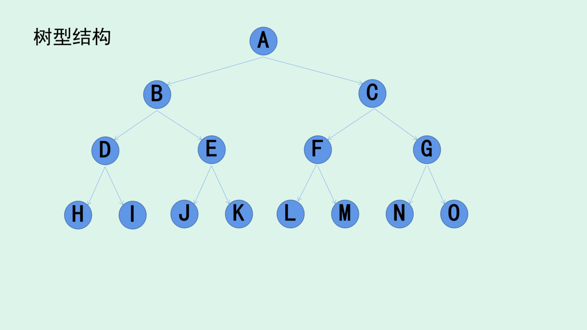

# practice programming ability --  编程学习记录


# Java 
[面向对象](./Java/src/object-oriented-programming.md)
[反射](./Java/src/Reflection.md)

# Array
[实现动态数组](./Array/src/Array.java)
# Stack
[数组实现Stack](./Stack/src/ArrayStack.java)

Stack实现计算表达式[+-*/()]

- [Stack实现10以内计算表达式](./Stack/src/Compute.java)
- [Stack实现计算表达式](./Stack/src/ComputeAnything.java)


[Stack实现浏览器前进后退功能](./Stack/src/BrowserStack.java)

### leetcode上关于栈的题目
20,155,232,844,224,682,496 

# Queue

数组实现Queue

数组实现loopQueue

# LinkedList

[链表实现Queue](./Linked/src/LinkedListQueue.java)

链表实现loopQueue

### leetcode上关于栈的题目

[LeetCode 206 reverse-linked-list](./Linked/src/Reverse.java)

141，21，19，876

# Recursion
将原来的问题转成更小的同一个问题

```
计算1加到7的和 
// 1 + 2 + 3 + 4 + 5 + 6 + 7    
等同于1到6的和加上7  
// (1 + 2 + 3 + 4 + 5 + 6) + 7
等同于1到6的和（1到5的和加上6）加上7   
// ((1 + 2 + 3 + 4 + 5) + 6) + 7
等同于1到5的和（1到4的和加上5）加上6 加上7 
// ((1 + 2 + 3 + 4) + 5) + 6) + 7
等同于1到4的和（1到3的和加上4）加上5 加上6 加上7 
// ((1 + 2 + 3) + 4) + 5) + 6) + 7
等同于1到3的和（1到2的和加上3）加上4 加上5 加上6 加上7 
// ((1 + 2) + 3) + 4) + 5) + 6) + 7
等同于1到2的和（1的和加上2） 加上3加上4 加上5 加上6 加上7 
1没法再分解了 
// ((1) + 2) + 3) + 4) + 5) + 6) + 7
// n之前所有数之和 + n = 1到n的所有数之和
```


[递归加法](./Recursion/src/Sum.java)

[猴子吃梨](./Recursion/src/EatPear.java)

[老鼠出迷宫](./Recursion/src/Mouse.java)

汉诺塔

八皇后

# 链表和递归


[LeetCode 203 remove-linked-list-elements](./Linked/src/Solution.java)


# Tree

- 节点：树结构中用于存储数据元素的部分称为节点。
- 根节点：我们的树是倒挂的，因此最上面的节点我们称之为根节点。
- 边：连接元素之间的引用我们称之为边。边是有方向的，从上游节点指向下游节点。
- 路径：顺着边，将经过的节点按顺序记录下来，称之为路径。路径上节点的个数称之为路径的长度。
- 父节点：节点的上游节点称之为父节点，通过指向某一节点的边可以找到它的父节点。
- 子节点：节点的下游节点称之为子节点，通过向下发出的边可以找到它的子节点。
- 兄弟节点：具有相同父节点的节点之间互称为兄弟节点。
- 叶节点：没有子节点的节点称之为叶节点，它是树在这个路径上的末端。
层次：根节点为第一层，根的所有子节点为第二层，第二层的所有子节点组成第三层，以此类推。
- 深度：从根节点到某一个节点的路径长度称之为该节点的深度。根节点的深度为 0。
- 高度：从某一节点出发到最远的叶节点的路径长度称之为该节点的高度。叶节点的高度为 0。


- 满二叉树

- 完全二叉树


## Binary Search Tree

## 遍历tree

### 前序遍历

### 中序遍历 

### 后序遍历


## 设计模式

设计原则

面向对象

## Linux

linux世界中，一切皆文件（硬件也是映射成一个文件）

### Linux目录


### vim
