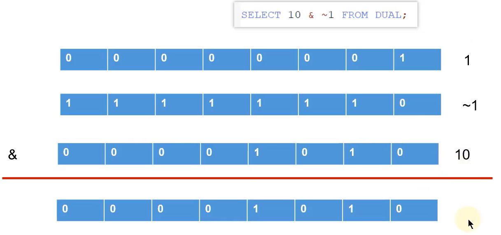

 ## DB：数据库（Database）   

 即存储数据的“仓库”，其本质是一个文件系统。它保存了一系列有组织的数据。 
 ## DBMS：数据库管理系统（Database Management System）     

 是一种操纵和管理数据库的大型软件，用于建立、使用和维护数据库，对数据库进行统一管理和控制。用户通过数据库管理系统访问数据库中表内的数据。 
 ## SQL：结构化查询语言（Structured Query Language）

 专门用来与数据库通信的语言。

 ## NoSQL

 键值型数据库  redis

 文档型数据库 MongoDB

 搜索引擎数据库 ES

 列式数据库 HBase

 图形数据库 Neo4J

## 关系型数据库设计规则

- 关系型数据库的典型数据结构就是`数据表`，这些数据表的组成都是结构化的（Structured）。

- 将数据放到表中，表再放到库中。

- 一个数据库中可以有多个表，每个表都有一个名字，用来标识自己。表名具有唯一性。

- 表具有一些特性，这些特性定义了数据在表中如何存储，类似Java和Python中 “类”的设计。


ORM思想  Object Relational Mapping 对象关系映射

数据库中表    类 class

表中一条数据      对象 实体 entity

表中的一个列   属性 字段 filed

## 关联关系
- 一对一   学生和身份证号
- 一对多   学校和学生
- 多对多   学生和各科老师
- 自我引用  学生和班长


## MySQL

- MySQL支持大型的数据库。可以处理拥有上千万条记录的大型数据库。
- MySQL支持大型数据库，支持5000万条记录的数据仓库，32位系统表文件最大可支持`4GB`，64位系统支持最大的表文件为`8TB`。
- MySQL使用`标准的SQL数据语言`形式。

```
mysql -V 查看版本
```

### 登录

1. 格式1

``` 
mysql -u用户名 -p密码
例如：mysql –uroot -proot

后插入密码
mysql -u用户名 -p回车

```

2. 格式2

``` 
mysql -hip地址 -u用户名 -p密码
例如：mysql –h127.0.0.1 –uroot -proot

```

3. 格式3

``` 
登录格式3：mysql --host=ip地址 --user=用户名 --password=密码
例如：mysql --host=127.0.0.1 --user=root --password=root


```


```
编码查询 mysql 命令模式下
show variables like '%char%';
```

如果MySQL的版本≥5.5.3，可以把编码设置为`utf8mb4`，`utf8mb4`和`utf8`完全兼容，但它支持最新的Unicode标准，可以显示`emoji字符`

### 分类

1. DDL(Data Definition Language)数据定义语言
用来定义数据库对象：数据库，表，列等。关键字：create, drop, alter等

2. DML(Data Manipulation Language)数据操作语言
用来对数据库中表的数据进行增删改。关键字：insert, delete, update等

3. DQL(Data Query Language)数据查询语言
用来查询数据库中表的记录(数据)。关键字：select, where等

4. DCL(Data Control Language)数据控制语言(了解)
用来定义数据库的访问权限和安全级别，及创建用户。关键字：GRANT， REVOKE等


> 还有单独将COMMIT、ROLLBACK 取出来称为TCL （Transaction Control Language，事务控制语言）。


### SQL通用语法

1. SQL语句可以单行或多行书写，以分号结尾。

2. 可使用空格和缩进来增强语句的可读性。

3. MySQL数据库的SQL语句不区分大小写，关键字建议使用大写。

## SQL规范
- 推荐采用统一的书写规范：
   - 数据库名、表名、表别名、字段名、字段别名等都小写
   - SQL 关键字、函数名、绑定变量等都大写

## 注 释

```
单行注释：#注释文字(MySQL特有的方式)
单行注释：-- 注释文字(--后面必须包含一个空格。)
多行注释：/* 注释文字  */

```

### DQL

```

SELECT   标识选择哪些列
FROM     标识从哪个表中选择
SELECT * FROM student; 选择全部列
```

> 一般情况下，除非需要使用表中所有的字段数据，最好不要使用通配符‘*’。使用通配符虽然可以节省输入查询语句的时间，但是获取不需要的列数据通常会降低查询和所使用的应用程序的效率。通配符的优势是，当不知道所需要的列的名称时，可以通过它获取它们。

> 在生产环境下，不推荐你直接使用SELECT *进行查询。

```
SELECT name, sex FROM student;

```

- 列的别名
AS: alias 
``` 
SELECT user_id AS uid FROM student;
``` 

- 去除重复行
distinct  distinct distinct  distinct

distinct distinct  distinct

```
SELECT DISTINCT manager_id AS mid FROM employees;
-- 在SELECT语句中使用关键字DISTINCT去除重复行

-- DISTINCT 需要放到所有列名的前面 
SELECT DISTINCT department_id,DISTINCT salary 
FROM employees;

-- 对后面所有列名的组合进行去重
SELECT DISTINCT department_id,salary 
FROM employees;
```

- 空值参与运算

MySQL 里面， 空值不等于空字符串。一个空字符串的长度是 0，而一个空值的长度是空。而且，在 MySQL 里面，空值是占用空间的。


- 着重号`` (解决和关键字相同的问题)

```
SELECT * FROM `ORDER`;
```

- 查询常数

补全固定数据，数据联查时，需要返回固定的数据时使用

``` mysql
SELECT '哈佛' as school, last_name FROM employees;

```

- 显示表结构

使用DESCRIBE 或 DESC 命令，表示表结构。

```mysql
DESCRIBE employees;
或
DESC employees;
```

```mysql
mysql> desc employees;
+----------------+-------------+------+-----+---------+-------+
| Field          | Type        | Null | Key | Default | Extra |
+----------------+-------------+------+-----+---------+-------+
| employee_id    | int(6)      | NO   | PRI | 0       |       |
| first_name     | varchar(20) | YES  |     | NULL    |       |
| last_name      | varchar(25) | NO   |     | NULL    |       |
| email          | varchar(25) | NO   | UNI | NULL    |       |
| phone_number   | varchar(20) | YES  |     | NULL    |       |
| hire_date      | date        | NO   |     | NULL    |       |
| job_id         | varchar(10) | NO   | MUL | NULL    |       |
| salary         | double(8,2) | YES  |     | NULL    |       |
| commission_pct | double(2,2) | YES  |     | NULL    |       |
| manager_id     | int(6)      | YES  | MUL | NULL    |       |
| department_id  | int(4)      | YES  | MUL | NULL    |       |
+----------------+-------------+------+-----+---------+-------+
11 rows in set (0.00 sec)
```

其中，各个字段的含义分别解释如下：

   - Field：表示字段名称。 
   - Type：表示字段类型，这里 barcode、goodsname 是文本型的，price 是整数类型的。
   - Null：表示该列是否可以存储NULL值。
   - Key：表示该列是否已编制索引。PRI表示该列是表主键的一部分；UNI表示该列是UNIQUE索引的一部分；MUL表示在列中某个给定值允许出现多次。
   - Default：表示该列是否有默认值，如果有，那么值是多少。
   - Extra：表示可以获取的与给定列有关的附加信息，例如AUTO_INCREMENT等。

- 过滤数据

``` SQL
SELECT * FROM employees WHERE manager_id=100;
```

`mysql在window中忽略大小写，包括对value的放水，不是标准的`

```
SELECT * FROM employees WHERE last_name='King';
SELECT * FROM employees WHERE last_name='king';   这个应该是查不出来的
```

```
-- 查询员工12个月的工资总和，并起别名为ANNUAL SALARY
SELECT employee_id , last_name,salary * 12  "ANNUAL  SALARY"
FROM employees;

-- 查询工资大于12000的员工姓名和工资
SELECT "中等收入" AS level, last_name, salary
FROM employees
WHERE salary > 12000;

```


- 算术运算符

算术运算符主要用于数学运算，其可以连接运算符前后的两个数值或表达式，对数值或表达式进行加（+）、减（-）、乘（*）、除（/  DIV）和取模（% MOD）运算。

sql中没有连接符  100 + '1' = 101

**1．加法与减法运算符**

```mysql
mysql> SELECT 100, 100 + 0, 100 - 0, 100 + 50, 100 + 50 -30, 100 + 35.5, 100 - 35.5 FROM dual;
+-----+---------+---------+----------+--------------+------------+------------+
| 100 | 100 + 0 | 100 - 0 | 100 + 50 | 100 + 50 -30 | 100 + 35.5 | 100 - 35.5 |
+-----+---------+---------+----------+--------------+------------+------------+
| 100 |     100 |     100 |      150 |          120 |      135.5 |       64.5 |
+-----+---------+---------+----------+--------------+------------+------------+
```

由运算结果可以得出如下结论：

> - 一个整数类型的值对整数进行加法和减法操作，结果还是一个整数；
> - 一个整数类型的值对浮点数进行加法和减法操作，结果是一个浮点数；
> - 加法和减法的优先级相同，进行先加后减操作与进行先减后加操作的结果是一样的；
> - 在Java中，+的左右两边如果有字符串，那么表示字符串的拼接。但是在MySQL中+只表示数值相加。如果遇到非数值类型，先尝试转成数值，如果转失败，就按0计算。（补充：MySQL中字符串拼接要使用字符串函数CONCAT()实现）

**2．乘法与除法运算符**

```mysql
mysql> SELECT 100, 100 * 1, 100 * 1.0, 100 / 1.0, 100 / 2,100 + 2 * 5 / 2,100 /3, 100 DIV 0 FROM dual;
+-----+---------+-----------+-----------+---------+-----------------+---------+-----------+
| 100 | 100 * 1 | 100 * 1.0 | 100 / 1.0 | 100 / 2 | 100 + 2 * 5 / 2 | 100 /3  | 100 DIV 0 |
+-----+---------+-----------+-----------+---------+-----------------+---------+-----------+
| 100 |     100 |     100.0 |  100.0000 | 50.0000 |        105.0000 | 33.3333 |      NULL |
+-----+---------+-----------+-----------+---------+-----------------+---------+-----------
```

由运算结果可以得出如下结论：

> - 一个数乘以整数1和除以整数1后仍得原数；
> - 一个数乘以浮点数1和除以浮点数1后变成浮点数，数值与原数相等；
> - 一个数除以整数后，不管是否能除尽，结果都为一个浮点数；
> - 一个数除以另一个数，除不尽时，结果为一个浮点数，并保留到小数点后4位；
> - 乘法和除法的优先级相同，进行先乘后除操作与先除后乘操作，得出的结果相同。
> - 在数学运算中，0不能用作除数，在MySQL中，一个数除以0为NULL。

**3．求模（求余）运算符**
```mysql
 12 % 5 = 2 
 12 % -5 = 2 
 -12 % 5 = -2
  -12 % -5 = -2  结果和除数相关

#筛选出employee_id是偶数的员工
SELECT * FROM employees
WHERE employee_id MOD 2 = 0;

SELECT * FROM employees
WHERE manager_id % 2 = 0;
```

100对3求模后的结果为3，对5求模后的结果为0。


- 逻辑运算符

逻辑运算符主要用来判断表达式的真假，在MySQL中，逻辑运算符的返回结果为1、0或者NULL。


**1．逻辑非运算符**
逻辑非（NOT或!）运算符表示当给定的值为0时返回1；当给定的值为非0值时返回0；当给定的值为NULL时，返回NULL。

```mysql
mysql> SELECT NOT 1, NOT 0, NOT(1+1), NOT !1, NOT NULL;    
+-------+-------+----------+--------+----------+
| NOT 1 | NOT 0 | NOT(1+1) | NOT !1 | NOT NULL |
+-------+-------+----------+--------+----------+
|     0 |     1 |        0 |      1 |     NULL |
+-------+-------+----------+--------+----------+
```

```mysql
SELECT last_name, manager_id 
FROM employees 
WHERE manager_id NOT IN(100, 124,144);
```

**2．逻辑与运算符**
逻辑与（AND或&&）运算符是当给定的所有值均为非0值，并且都不为NULL时，返回1；当给定的一个值或者多个值为0时则返回0；否则返回NULL。

```mysql
mysql> SELECT 1 AND -1, 0 AND 1, 0 AND NULL, 1 AND NULL;
+----------+---------+------------+------------+
| 1 AND -1 | 0 AND 1 | 0 AND NULL | 1 AND NULL |
+----------+---------+------------+------------+
|        1 |       0 |          0 |       NULL |
+----------+---------+------------+------------+
1 row in set (0.00 sec)
```

```mysql
SELECT employee_id, last_name, job_id, salary, manager_id
FROM   employees
WHERE  salary >=10000
AND manager_id > 120;

SELECT employee_id, last_name, job_id, salary, manager_id
FROM   employees
WHERE  salary >=10000 && manager_id < 120;

SELECT employee_id, last_name, job_id, salary, manager_id
FROM   employees
WHERE  salary >=10000 
AND manager_id < 120
AND job_id LIKE "%VP%"
```

**3．逻辑或运算符**
逻辑或（OR或||）运算符是当给定的值都不为NULL，并且任何一个值为非0值时，则返回1，否则返回0；当一个值为NULL，并且另一个值为非0值时，返回1，否则返回NULL；当两个值都为NULL时，返回NULL。

```mysql
mysql> SELECT 1 OR -1, 1 OR 0, 1 OR NULL, 0 || NULL, NULL || NULL;     
+---------+--------+-----------+-----------+--------------+
| 1 OR -1 | 1 OR 0 | 1 OR NULL | 0 || NULL | NULL || NULL |
+---------+--------+-----------+-----------+--------------+
|       1 |      1 |         1 |    NULL   |       NULL   |
+---------+--------+-----------+-----------+--------------+
1 row in set, 2 warnings (0.00 sec)
```

```mysql
#查询基本薪资不在9000-12000之间的员工编号和基本薪资
SELECT employee_id,salary FROM employees 
WHERE NOT (salary >= 9000 AND salary <= 12000);

SELECT employee_id,salary FROM employees 
WHERE salary < 9000 || salary > 12000;

SELECT employee_id,salary FROM employees 
WHERE salary NOT BETWEEN 9000 AND 12000;
```

```mysql
SELECT employee_id, last_name, job_id, salary
FROM   employees
WHERE  salary >= 10000
OR     job_id LIKE '%MAN%';

SELECT employee_id, last_name, job_id, salary
FROM   employees
WHERE  salary >= 10000 || job_id LIKE '%VP%';
```

> 注意：
> OR可以和AND一起使用，但是在使用时要注意两者的优先级，由于AND的优先级高于OR，因此先对AND两边的操作数进行操作，再与OR中的操作数结合。

**4．逻辑异或运算符**
逻辑异或（XOR）运算符是当给定的值中任意一个值为NULL时，则返回NULL；如果两个非NULL的值都是0或者都不等于0时，则返回0；如果一个值为0，另一个值不为0时，则返回1。

```mysql
mysql> SELECT 1 XOR -1, 1 XOR 0, 0 XOR 0, 1 XOR NULL, 1 XOR 1 XOR 1, 0 XOR 0 XOR 0;
+----------+---------+---------+------------+---------------+---------------+
| 1 XOR -1 | 1 XOR 0 | 0 XOR 0 | 1 XOR NULL | 1 XOR 1 XOR 1 | 0 XOR 0 XOR 0 |
+----------+---------+---------+------------+---------------+---------------+
|        0 |       1 |       0 |       NULL |             1 |             0 |
+----------+---------+---------+------------+---------------+---------------+
1 row in set (0.00 sec)
```

```mysql
select last_name,department_id,salary 
from employees
where department_id in (10,20) XOR salary > 8000;
```

## 4. 位运算符

位运算符是在二进制数上进行计算的运算符。位运算符会先将操作数变成二进制数，然后进行位运算，最后将计算结果从二进制变回十进制数。

MySQL支持的位运算符如下：


**1．按位与运算符**
按位与（&）运算符将给定值对应的二进制数逐位进行逻辑与运算。当给定值对应的二进制位的数值都为1时，则该位返回1，否则返回0。

```mysql
mysql> SELECT 1 & 10, 20 & 30;
+--------+---------+
| 1 & 10 | 20 & 30 |
+--------+---------+
|      0 |      20 |
+--------+---------+
1 row in set (0.00 sec)
```

1的二进制数为0001，10的二进制数为1010，所以1 & 10的结果为0000，对应的十进制数为0。20的二进制数为10100，30的二进制数为11110，所以20 & 30的结果为10100，对应的十进制数为20。

**2. 按位或运算符**
按位或（|）运算符将给定的值对应的二进制数逐位进行逻辑或运算。当给定值对应的二进制位的数值有一个或两个为1时，则该位返回1，否则返回0。

```mysql
mysql> SELECT 1 | 10, 20 | 30; 
+--------+---------+
| 1 | 10 | 20 | 30 |
+--------+---------+
|     11 |      30 |
+--------+---------+
1 row in set (0.00 sec)
```

1的二进制数为0001，10的二进制数为1010，所以1 | 10的结果为1011，对应的十进制数为11。20的二进制数为10100，30的二进制数为11110，所以20 | 30的结果为11110，对应的十进制数为30。

**3. 按位异或运算符**
按位异或（^）运算符将给定的值对应的二进制数逐位进行逻辑异或运算。当给定值对应的二进制位的数值不同时，则该位返回1，否则返回0。

```mysql
mysql> SELECT 1 ^ 10, 20 ^ 30; 
+--------+---------+
| 1 ^ 10 | 20 ^ 30 |
+--------+---------+
|     11 |      10 |
+--------+---------+
1 row in set (0.00 sec)
```

1的二进制数为0001，10的二进制数为1010，所以1 ^ 10的结果为1011，对应的十进制数为11。20的二进制数为10100，30的二进制数为11110，所以20 ^ 30的结果为01010，对应的十进制数为10。

再举例：

```mysql
mysql> SELECT 12 & 5, 12 | 5,12 ^ 5 FROM DUAL;
+--------+--------+--------+
| 12 & 5 | 12 | 5 | 12 ^ 5 |
+--------+--------+--------+
|      4 |     13 |      9 |
+--------+--------+--------+
1 row in set (0.00 sec)
```


**4. 按位取反运算符**
按位取反（~）运算符将给定的值的二进制数逐位进行取反操作，即将1变为0，将0变为1。



```mysql
mysql> SELECT 10 & ~1;
+---------+
| 10 & ~1 |
+---------+
|      10 |
+---------+
1 row in set (0.00 sec)
```

由于按位取反（~）运算符的优先级高于按位与（&）运算符的优先级，所以10 & ~1，首先，对数字1进行按位取反操作，结果除了最低位为0，其他位都为1，然后与10进行按位与操作，结果为10。

**5. 按位右移运算符**
按位右移（>>）运算符将给定的值的二进制数的所有位右移指定的位数。右移指定的位数后，右边低位的数值被移出并丢弃，左边高位空出的位置用0补齐。

```mysql
mysql> SELECT 1 >> 2, 4 >> 2;
+--------+--------+
| 1 >> 2 | 4 >> 2 |
+--------+--------+
|      0 |      1 |
+--------+--------+
1 row in set (0.00 sec)
```

1的二进制数为0000 0001，右移2位为0000 0000，对应的十进制数为0。4的二进制数为0000 0100，右移2位为0000 0001，对应的十进制数为1。

**6. 按位左移运算符**
按位左移（<<）运算符将给定的值的二进制数的所有位左移指定的位数。左移指定的位数后，左边高位的数值被移出并丢弃，右边低位空出的位置用0补齐。

```mysql
mysql> SELECT 1 << 2, 4 << 2;  
+--------+--------+
| 1 << 2 | 4 << 2 |
+--------+--------+
|      4 |     16 |
+--------+--------+
1 row in set (0.00 sec)
```

1的二进制数为0000 0001，左移两位为0000 0100，对应的十进制数为4。4的二进制数为0000 0100，左移两位为0001 0000，对应的十进制数为16。


### DDL
#### 操作数据库

1. 直接创建数据库
```
CREATE DATABASE 数据库名;
CREATE DATABASE `learning1`;
```

2. 判断是否存在并创建数据库
```
CREATE DATABASE IF NOT EXISTS 数据库名;
CREATE DATABASE IF NOT EXISTS `learning2`;
```
3. 创建数据库并指定字符集(编码表)
```
CREATE DATABASE 数据库名 CHARACTER SET 字符集;
CREATE DATABASE `learning3` CHARACTER SET utf8;
```

4. 查看数据库
```
查看所有的数据库
SHOW DATABASES;  
查看某个数据库的定义信息
SHOW CREATE DATABASE learning2;
```
5. 修改数据库
```
ALTER DATABASE `learning2` DEFAULT CHARACTER SET gbk;
```

6. 删除数据库
```
DROP DATABASE `learning2`;
```

7. 使用数据库

```
SELECT DATABASE(); 
查看正在使用的数据库

USE `learning1`;
使用/切换数据库
```

#### 操作表

``` 
CREATE TABLE `Student` (
   `id` INT,
   `name` VARCHAR(32),
   `birthday` DATE
)
```

MySQL中的我们常使用的数据类型如下：

| 类型      | 描述 |
| ----------- | ----------- |
| int      | 整型      |
| double   | 浮点型       |
| varchar   | 字符串型       |
| data   | 日期类型：yyyy-MM-dd        |
|  |  |

```
1. 查看某个数据库中的所有表
SHOW TABLES;
2. 查看表结构
DESC `Student`
3. 查看创建表的SQL语句
SHOW CREATE TABLE `Student`;
4. 快速创建一个表结构相同的表
CREATE TABLE `s2` LIKE `Student`;
DESC `s2`;
5. 删除表
DROP TABLE `s2`;
DROP TABLE IF EXISTS `s2`;

```


### 约束条件

``` SQL
CREATE TABLE IF NOT EXISTS `Person`(
   `s_id` VARCHAR(20) PRIMARY KEY,
	 `s_name` VARCHAR(20) NOT NULL,
	 `s_age` int DEFAULT 18,
	 `s_sex` VARCHAR(20) NOT NUll DEFAULT '未知'
);
```

1. PRIMARY KEY
   主键
   联合主键：
   ``` SQL
   CREATE TABLE IF NOT EXISTS `Score`(
      `s_id` VARCHAR(20),
		`s_score` INT(3),
		`c_id` VARCHAR(20),
		PRIMARY KEY(`s_id`,`c_id`)
   );
   ```


2. NOT NULL
   非空的约束，也就是不能向表里插入空值（NULL），字符串""不是空值
   ``` SQL
    INSERT INTO `Person` VALUES('1',NULL); 
    // 报错
    ```
3. DEFAULT
   在不给字段输入值时，默认返回的结果,`s_age`没有输入值返回了默认值`18` .
   ``` SQL
    INSERT INTO `Person` (s_id,s_name,s_sex) VALUES('3','liu','男');
    // 3 liu 18 男
    ```
4. NOT NUll DEFAULT
   not null 和 default是两个独立的约束，
   设置为NULL时，会触发NOT NULL，
   DEFAULT只有在不给字段数据时才会触发
   `s_age`没有输入值返回了默认值`18` .
   `s_sex`没有输入值，不为NULL不会因NOT NULL报错，触发DEFAULT，默认值返回`未知`.
  
   ``` SQL
   INSERT INTO `Person` (s_id,s_name) VALUES('4','liu');
   // 4 liu 18 未知
   ```

### value和values

都可以插入多行数据（在oracle数据库中只有insert into values，而没有insert into value）


### MySQL案例

#### 创建
``` SQL
CREATE DATABASE IF NOT EXISTS `LearnSQL`;

``` 

``` SQL
CREATE TABLE `Student`(
   `s_id` VARCHAR(20) PRIMARY KEY,
   `s_name` VARCHAR(20) NOT NULL DEFAULT '',
   `s_birth` VARCHAR(20) NOT NULL DEFAULT '',
   `s_sex` VARCHAR(10) NOT NULL DEFAULT ''
);
``` 

``` SQL
CREATE TABLE `Course`(
   `c_id` VARCHAR(20) PRIMARY KEY,
   `c_name` VARCHAR(20) NOT NULL DEFAULT '',
   `t_id` VARCHAR(20) NOT NULL
);
``` 

``` SQL
CREATE TABLE `Teacher`(
   `t_id` VARCHAR(20) PRIMARY KEY,
   `t_name` VARCHAR(20) NOT NULL DEFAULT ''
);
``` 

``` SQL
CREATE TABLE `Score`(
   `s_id` VARCHAR(20),
   `c_id` VARCHAR(20),
   `s_score` INT(3),
   PRIMARY KEY(`s_id`,`c_id`)
);
``` 


#### 插入
``` SQL
INSERT INTO  `Student` VALUES
('01' , '赵雷' , '1990-01-01' , '男'),
('02' , '钱电' , '1990-12-21' , '男'),
('03' , '孙风' , '1990-05-20' , '男'),
('04' , '李云' , '1990-08-06' , '男'),
('05' , '周梅' , '1991-12-01' , '女'),
('06' , '吴兰' , '1992-03-01' , '女'),
('07' , '郑竹' , '1989-07-01' , '女'),
('08' , '王菊' , '1990-01-20' , '女');

``` 

``` SQL
INSERT INTO `Course` VALUES
('01' , '语文' , '02'),
('02' , '数学' , '01'),
('03' , '英语' , '03');

```

``` SQL
INSERT INTO `Teacher` VALUES
('01' , '周' ),
('02' , '刘' ),
('03' , '王' );

```

``` SQL
INSERT INTO `Score` VALUES
('01' , '01' , 80),
('01' , '02' , 90),
('01' , '03' , 99),
('02' , '01' , 70),
('02' , '02' , 60),
('02' , '03' , 80),
('03' , '01' , 80),
('03' , '02' , 80),
('03' , '03' , 80),
('04' , '01' , 50),
('04' , '02' , 30),
('04' , '03' , 20),
('05' , '01' , 76),
('05' , '02' , 87),
('06' , '01' , 31),
('06' , '03' , 34),
('07' , '02' , 89),
('07' , '03' , 98);

```

#### 查询


