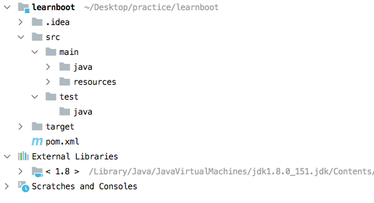

# SpringBoot 快速启动 （一站式开发）
Spring Boot 目标主要是应用了快速开发，简化整个项目的配置和依赖工作，提升开发效率，更快速地构建应用程序（零配置情况下一键启动，简洁而优雅）

- 简化依赖，提供整合的依赖项；
- 简化配置，提供约定俗成的默认配置；
- 简化部署，内置 servlet 容器，开发时一键即运行。可打包为 jar 文件，部署时一行命令即启动；
- 简化监控，提供简单方便的运行监控方式。

## Spring Initializr
- Group 表示项目所属的机构 习惯上采用倒置的域名作为 Group 的值 com.jingzhaoshare
- 项目标识设置：Artifact 是项目标识，用来区分项目。项目标识习惯性地采用小写英文单词，单词间加横杠的形式。比如 Spring Boot 官方提供的很多依赖，都是 spring-boot-starter-xxx 的形式
- 项目名称设置：Name 是项目名称，保持与 Artifact 一致即可；
- 默认包名设置：Package name 是默认包名，保持默认即可；
- 打包方式选择：此处选择将项目打包为 Jar 文件；
- 添加项目依赖：我们直接在 pom.xml 中添加依赖，可以指定我们项目需要引入的版本

## Spring Boot 项目结构



- learnboot 是我们指定的项目名称；
- src/main/java 是 Java 源代码目录，存放我们编写的 Java 代码；
- src/main/resources 目录是静态资源目录，存放图片、脚本文件、配置文件等静态资源；
- src/test/java 目录是测试目录，存放测试类。测试是非常重要的，从目录级别跟源代码同级，就能看出来测试的重要性；
- target 目录存放我们打包生成的内容；
- pom.xml 是项目的 Maven 配置文件，指定了项目的基本信息以及依赖项，Maven 就是通过配置文件得知项目构建规则的。

## pom.xml 详解

1. Maven 文档配置

``` xml
<?xml version="1.0" encoding="UTF-8"?>
<project xmlns="http://maven.apache.org/POM/4.0.0"
         xmlns:xsi="http://www.w3.org/2001/XMLSchema-instance"
         xsi:schemaLocation="http://maven.apache.org/POM/4.0.0 http://maven.apache.org/xsd/maven-4.0.0.xsd">
    <modelVersion>4.0.0</modelVersion>
</project>
```

2. 项目信息配置
``` xml
	<groupId>com.imooc</groupId>
	<artifactId>spring-boot-learn</artifactId>
	<version>0.0.1-SNAPSHOT</version>
	<name>spring-boot-learn</name>
	<description>Demo project for Spring Boot</description>
```


3. Spring Boot 版本配置

``` xml
	<parent>
		<groupId>org.springframework.boot</groupId>
		<artifactId>spring-boot-starter-parent</artifactId>
		<version>2.5.5</version>
		<relativePath/> <!-- lookup parent from repository -->
	</parent>
```
4. 依赖配置
``` xml
<dependencies>
        <dependency>
            <groupId>org.springframework.boot</groupId>
            <artifactId>spring-boot-starter-web</artifactId>
        </dependency>

        <dependency>
            <groupId>org.springframework.boot</groupId>
            <artifactId>spring-boot-starter-test</artifactId>
            <scope>test</scope>
        </dependency>
    </dependencies>
```
> 可以看到上面两个依赖我们并没有指定版本号，其实是因为 Spring Boot 2.2.5 已经有默认的依赖项版本号了。这是通过 Maven 父继承实现的，即 <parent> 标签配置部分，这个稍作了解即可。

5. 插件配置
``` xml
<build>
    <plugins>
        <plugin>
            <groupId>org.springframework.boot</groupId>
            <artifactId>spring-boot-maven-plugin</artifactId>
        </plugin>
    </plugins>
</build>

```


## Spring Boot 项目启动机制


### application.properties配置
spring.application.name 设置程序名。如果你是微服务的话，它起到了唯一标识的作用  
server.port=8088 设置端口


mybatis.mapper-locations=classpath:/mapper/*.xml  设置mapper.xml的路径


### 接口返回字符串

``` java

@RestController
@RequestMapping("/v3")
public class HelloController {
    @GetMapping("/hello2")
    public String hello2(){
        return "hello2";
    }

    @GetMapping("hello3")
    public String hello3(){
        return "hello3";
    }

    @RequestMapping("hello1")
    public String hello(){
        return "hello1";
    }

    @RequestMapping("/hello4")
    public String hello4(){
        return "hello4";
    }

}
```

RequestMapping和GetMapping后面都可以不写`/`,规范要写


### 接口返回json

返回的是 Jackson 数据，默认用的 是 Jackson 序列化

``` java
// Entity/Coupon
@Data
public class Coupon {
    private int id;
    private String name;
}

```


``` java
// Controller/CouponController
import com.example.aliyunlearning.Entity.Coupon;
import org.springframework.web.bind.annotation.RequestMapping;
import org.springframework.web.bind.annotation.RestController;

@RestController
public class CouponController {

    @RequestMapping("/coupon")
    public Coupon Coupon(){

        Coupon coupon = new Coupon();
        coupon.setId(1);
        coupon.setName("couponName");
        return coupon;
    }
}
```
### 使用数据库

Spring boot简单步骤

1、建立实体类，跟数据库表字段保持一致

2、建立mapper接口，定义要操作数据库的动作, 写具体的sql语句(也可以建立mapper的xml文件)

3、建立service类，处理业务逻辑

4、在controller 类中展示处理的结果


`/***写具体的sql语句***/`

``` java

// entity/User
@Data
public class User {
    private Integer id;
    private String name;
}

// mapper接口

public interface UserMapper {
    @Select("select * from User")
    List<User> findAll();
}


// controller/HelloController
@RestController
@RequestMapping("/v3")
public class HelloController {

    @Resource
    UserMapper userMapper;

    @GetMapping("/UserList")
    public List<User> getUser() {
        return userMapper.findAll();
    }
}
```

`/***建立mapper的xml文件***/`

``` xml
// resources/mapper/UserMapper.xml
<?xml version="1.0" encoding="UTF-8" ?>
<!DOCTYPE mapper PUBLIC "-//mybatis.org//DTD Mapper 3.0//EN" "http://mybatis.org/dtd/mybatis-3-mapper.dtd" >
<mapper namespace="com.example.testdemo.mapper.UserMapper">
    <select id="findList" resultType="com.example.testdemo.entity.User">
        SELECT * FROM User
    </select>
</mapper>

namespace="com.example.testdemo.mapper.UserMapper"  是mapper接口的全路径
resultType="com.example.testdemo.entity.User"  是实体类全路径 
```

``` 
// application.properties
mybatis.mapper-locations=classpath:/mapper/*.xml   resources中xml的路径
```

``` java

// entity/User
@Data
public class User {
    private Integer id;
    private String name;
}

// mapper接口

public interface UserMapper {
    List<User> findList();
}


// controller/HelloController
@RestController
@RequestMapping("/v3")
public class HelloController {

    @Resource
    UserMapper userMapper;

    @GetMapping("/Users")
    public List<User> getUser() {
        return userMapper.findList();
    }
}
```

## 代码反向生成

## 代码生成平台